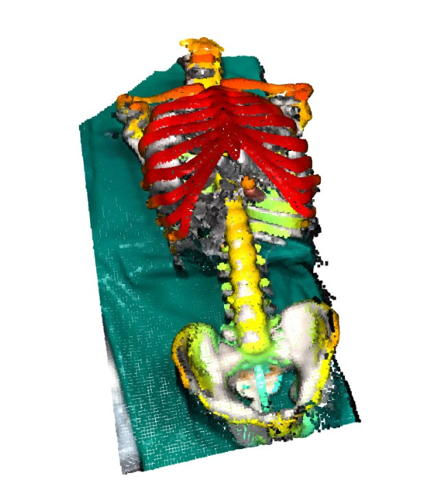

# Image-Guided Robotic Needle Placement

A ROS-based system for autonomous robotic needle placement using a **Franka Emika Panda** arm and **Microsoft Azure Kinect** depth camera. The robot scans a chest phantom, registers it against a CT model, and performs precise needle insertion — fully autonomously.

---

## Demo

<table>
  <tr>
    <td align="center" valign="top" width="50%">

**Robot Execution**

[▶ Click to view video](https://github.com/user-attachments/assets/a96614c7-a39d-47de-bc48-e2d2e79f3ea2)

</td>

<td align="center" valign="top" width="50%">

**Point Cloud Registration**

</td>
  </tr>
</table>

---

## System Overview

The pipeline consists of four main stages:

1. **3D Scanning** — Azure Kinect captures point clouds of the phantom from multiple viewpoints
2. **Calibration** — Camera calibration + eye-in-hand calibration to align the camera with the robot base frame
3. **Model Registration** — Point clouds are registered against a CT-derived phantom model to identify the insertion target
4. **Trajectory Planning & Execution** — Collision-free trajectory is computed and executed on the real robot

---

## Stack

- [ROS](https://www.ros.org/) — robot control and communication
- [Franka Emika Panda](https://franka.de/) — 7-DOF robotic arm
- [Microsoft Azure Kinect](https://azure.microsoft.com/en-us/products/kinect-dk) — RGB-D depth camera
- [Open3D](http://www.open3d.org/) — point cloud processing and registration
- [OpenCV](https://opencv.org/) — camera calibration and hand-eye calibration
- [RViz](http://wiki.ros.org/rviz) — simulation and trajectory validation

---

## Key Features

- Jacobian-based incremental inverse kinematics for the 7-DOF Panda
- Quintic polynomial trajectory generation for smooth, jerk-minimized motion
- Two-stage trajectory planning — configuration space + task space straight-line insertion
- ICP-based point cloud registration for precise phantom localization
- Full sim-to-real transfer validated on the physical robot

---

## Report

For full details on methodology, kinematics, calibration, and results, see [`report.pdf`](./Report/RNM_Final_Report.pdf).

---

## Acknowledgements

Guided by **Prof. Alexander Schlaefer**, with tutors **Konrad Reuter** and **Michael Meyling** at the Institute of Medical Technology and Intelligent Systems (MTEC), TUHH.
